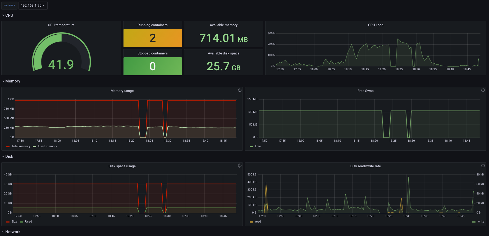

# Raspberry Cluster monitoring

Ansible roles to install and configure a cluster of Raspberry Pi (2, 3 and 4).



## Ansible Roles

### Basic Config

`Scope: all`


* Configure SSH public key and disable password authentification.
* Install vim

### Node exporter

`Scope: all`


* Installs and exposes [Prometheus Node Exporter](https://github.com/prometheus/node_exporter) as a systemd service.

Used for general system metrics.

### RPI exporter

`Scope: all`


* Installs and exposes [Prometheus RPI Exporter](https://github.com/lukasmalkmus/rpi_exporter) as a systemd service.

Collects cpu and gpu temperature metrics.

### RPI metrics

`Scope: all`


* Exposes [default](https://docs.docker.com/config/daemon/prometheus/) Docker daemon metrics for Prometheus.

The idea of this role is to add custom and additional metrids. TODO: Add [google/cadvisor](https://github.com/google/cadvisor) exporter for running containers.

### Prometheus

`Scope: master`


* Installs and configures Prometheus with all exporters endpoints.

### Grafana

`Scope: master`


* Installs and configures Grafana with an example dashboard.


## Usage

Modify the `inventory` file with the corresponding IPs of your raspberries:

```yaml
[master]
192.168.1.90

[nodes]
192.168.1.70
192.168.1.80
192.168.1.60
```

Run `raspberry.yml` playbook: 

```bash
make all
// Or
ansible-galaxy install -r requirements.yml --roles-path roles/ && ansible-playbook raspberry.yml -i inventory
```

### Extra

- Cool alert rules file: https://gist.github.com/krisek/62a98e2645af5dce169a7b506e999cd8#file-alert-rules-yml
